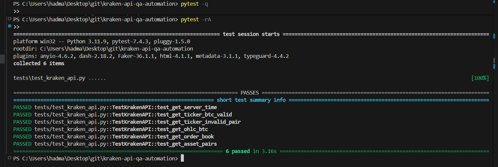

[](https://github.com/RanAlmagor/kraken-api-qa-automation/actions/workflows/ci.yml)

# Kraken API QA Automation (pytest)

Automated API checks for **Kraken's public REST endpoints** using **Python + pytest**.  
Portfolio-ready QA automation: clear assertions, reusable API client, and CI that runs on every push/PR.



## What this project demonstrates (QA skills)

- **API testing**: schema + data validation (not just status code)
- **Automation**: repeatable local runs + CI
- **Test design**: readable test names, Arrange/Act/Assert structure
- **Reporting**: JUnit output for CI artifacts
- **Tooling**: pytest, requests, GitHub Actions

## Tests included

These tests call Kraken **public** endpoints (no API key needed):

- `/0/public/Time` — server time is returned and looks valid
- `/0/public/Ticker` — price fields exist and parse, values are sane (> 0)
- `/0/public/OHLC` — candle list returned, basic consistency checks
- `/0/public/AssetPairs` — expected pair exists and has required metadata
- `/0/public/Depth` — order book returns bids/asks lists (non-empty)

> Note: Public endpoints can be temporarily slow or rate-limited. The suite is intentionally small and fast.

## Project structure

```
kraken-api-qa-automation/
├─ tests/                 # pytest test suite
├─ utils/                 # KrakenAPI wrapper (requests)
├─ reports/               # junit.xml output (generated)
├─ requirements.txt       # Python dependencies
└─ .github/workflows/     # CI pipeline (GitHub Actions)
```

## Quick start (local)

### 1) Create & activate a virtual environment

**Windows (PowerShell):**
```powershell
python -m venv .venv
.\.venv\Scripts\Activate.ps1
```

> If PowerShell blocks activation, run:
> `Set-ExecutionPolicy -Scope Process -ExecutionPolicy Bypass`

### 2) Install dependencies

```bash
python -m pip install --upgrade pip
pip install -r requirements.txt
```

### 3) Run the tests

**Minimal output:**
```bash
pytest -q
```

**Show a nice summary of what passed/failed:**
```bash
pytest -rA
```

**Very verbose (great for debugging):**
```bash
pytest -vv
```

### (Optional) Generate a JUnit report

```bash
mkdir reports
pytest -q --junitxml=reports/junit.xml
```

## Demo: one-liner API check (optional)

This calls Kraken's **Time** and **Ticker** endpoints and prints the result:

```bash
python -c "from utils.kraken_api import KrakenAPI; api=KrakenAPI(); t=api.get_server_time(); print('TIME:', t); r=api.get_ticker('XXBTZUSD'); last=r['result']['XXBTZUSD']['c'][0]; print('BTC/USD last price:', last)"
```

## CI (GitHub Actions)

- Runs automatically on **push** and **pull_request**
- Runs the suite on Python **3.10 / 3.11 / 3.12**
- Uploads `reports/junit.xml` as an artifact for each Python version

### Where to see results
Open the repository → **Actions** → click the latest run → click a job like `pytest (3.11)` → open the **Run tests** step.  
There you'll see output like `6 passed in ...`.

### Why there are 3 report artifacts
Because the CI uses a Python version matrix. Each version runs independently and produces its own `junit.xml`.

## FAQ

### Why is `reports/` empty on my PC?
It only gets files when you run:
```bash
pytest -q --junitxml=reports/junit.xml
```
In CI, the file is generated on GitHub’s runner and uploaded as an artifact, so your local folder can still be empty.

### There are empty `__init__.py` files — delete them?
No need. They’re harmless and commonly used to make `tests/` and `utils/` behave as proper Python packages for imports.

## License

MIT
